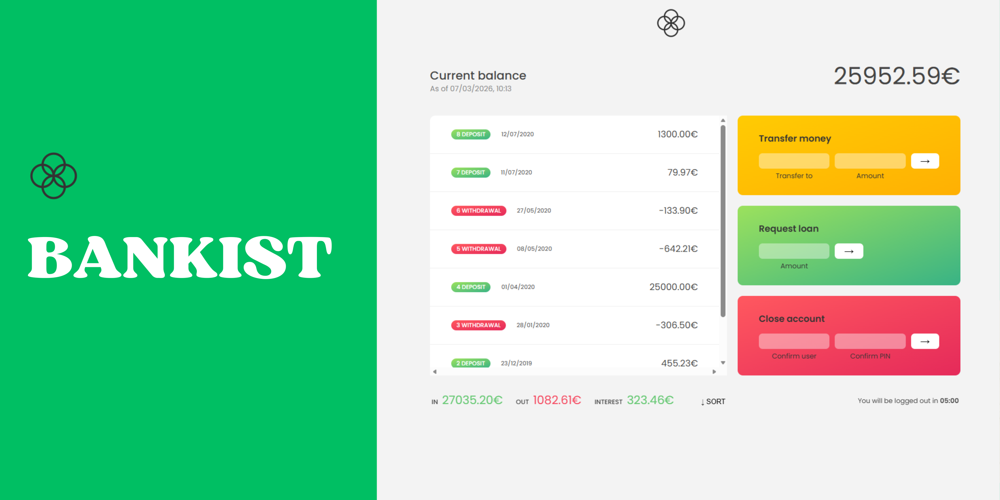
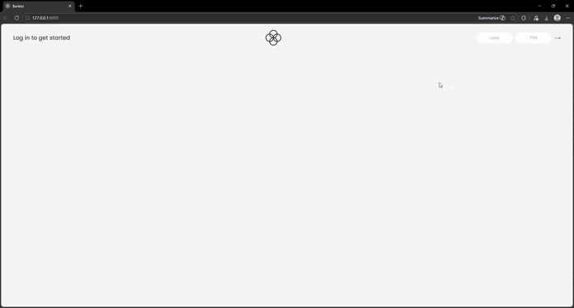

<h1 align="center">

</h1>

<h2 align="center"> 
	BANKIST - Completed ✅
</h2>

<h2 id="#description">Project description 📚</h2>

This project was developed to put array and dates methods into practice in JavaScript

<h3>The objective of the project is to simulate a bank with transfers, account closing and loans, see below for a quick preview: </h3>

<h2 id="#description">Flowchart of what will be implemented in the project.📝</h2>

## Technology

This project was developed with the following technologies:

- [HTML](https://reactjs.org)
- [CSS](https://www.typescriptlang.org/)
- [Vanilla Js](https://styled-components.com/)

Main array methods used in the project:

- [forEach()](https://developer.mozilla.org/pt-BR/docs/Web/JavaScript/Reference/Global_Objects/Array/forEach)

- [map()](https://developer.mozilla.org/en-US/docs/Web/JavaScript/Reference/Global_Objects/Array/map)

- [reduce()](https://developer.mozilla.org/en-US/docs/Web/JavaScript/Reference/Global_Objects/Array/reduce)

- [find()](https://developer.mozilla.org/pt-BR/docs/Web/JavaScript/Reference/Global_Objects/Array/find)

- [filter()](https://developer.mozilla.org/pt-BR/docs/Web/JavaScript/Reference/Global_Objects/Array/filter)

- [sort()](https://developer.mozilla.org/pt-BR/docs/Web/JavaScript/Reference/Global_Objects/Array/sort)

- [join()](https://developer.mozilla.org/en-US/docs/Web/JavaScript/Reference/Global_Objects/Array/join)

- [push()](https://developer.mozilla.org/pt-BR/docs/Web/JavaScript/Reference/Global_Objects/Array/push)

 

## 👨🏽‍💻 Author

- [Frontend Mentor](https://www.frontendmentor.io/profile/viniciusshenri96)
- [Linkedin](https://www.linkedin.com/in/vinícius-henrique-7a2533229/)
