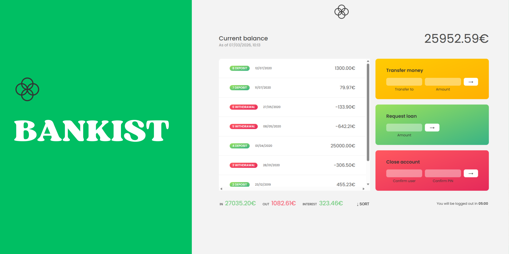
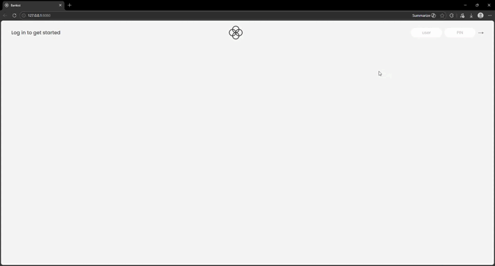

<h1 align="center">

</h1>

<h2 align="center"> 
	BANKIST - Completed ✅
</h2>

<h2 id="#description">Project description 📚</h2>
This project was developed to put array and dates methods into practice in JavaScrip. The objective of the project is to simulate a bank with transfers, account closing and loans, see below for a quick preview:

<h3 id="#description">Preview project:</h3>


<h3 id="#description">Flowchart project.📝</h3>


## Technology

This project was developed with the following technologies:

- [HTML](https://reactjs.org)
- [CSS](https://www.typescriptlang.org/)
- [Vanilla Js](https://styled-components.com/)

<hr>

Main array methods used in the project, Dates, Internationalizing Dates (Intl) and SetTimeout, setInterval and clearInterval:

- [forEach()](https://developer.mozilla.org/pt-BR/docs/Web/JavaScript/Reference/Global_Objects/Array/forEach)

- [map()](https://developer.mozilla.org/en-US/docs/Web/JavaScript/Reference/Global_Objects/Array/map)

- [reduce()](https://developer.mozilla.org/en-US/docs/Web/JavaScript/Reference/Global_Objects/Array/reduce)

- [find()](https://developer.mozilla.org/pt-BR/docs/Web/JavaScript/Reference/Global_Objects/Array/find)

- [filter()](https://developer.mozilla.org/pt-BR/docs/Web/JavaScript/Reference/Global_Objects/Array/filter)

- [sort()](https://developer.mozilla.org/pt-BR/docs/Web/JavaScript/Reference/Global_Objects/Array/sort)

- [join()](https://developer.mozilla.org/en-US/docs/Web/JavaScript/Reference/Global_Objects/Array/join)

- [push()](https://developer.mozilla.org/pt-BR/docs/Web/JavaScript/Reference/Global_Objects/Array/push)

Internationalizing Dates (Intl) ans Dates:

```js
// Internationalizing Dates (Intl)
const formatCur = function (value, locale, currency) {
  return new Intl.NumberFormat(locale, {
    style: 'currency',
    currency: currency,
  }).format(value);
};
```

Dates:

```js
// Dates
const now = new Date();
const options = {
  hour: 'numeric',
  minute: 'numeric',
  day: 'numeric',
  month: 'numeric',
  year: 'numeric',
};
labelDate.textContent = new Intl.DateTimeFormat(
  currentAccount.locale,
  options,
).format(now);
```

Implementing a Countdown Timer:

```js
const startLogOutTimer = function () {
  // Set time to 5 minutes

  const tick = function () {
    const min = String(Math.trunc(time / 60)).padStart(2, 0);
    const sec = String(time % 60).padStart(2, 0);
    // In each call, print the remaining time to  UI
    labelTimer.textContent = `${min}:${sec}`;

    // When 0 seconds, stop timer and log out user
    if (time === 0) {
      clearInterval(timer);
      labelWelcome.textContent = 'Log in to get started';
      containerApp.style.opacity = 0;
    }
    // Decrese 1s
    time--;
  };

  let time = 300;

  // Call the timer every second
  // OBS: setInterval only runs for the first time after 1s
  tick();
  const timer = setInterval(tick, 1000);
  return timer;
};
```

<br />

## 👨🏽‍💻 Author

- [Frontend Mentor](https://www.frontendmentor.io/profile/viniciusshenri96)
- [Linkedin](https://www.linkedin.com/in/vinícius-henrique-7a2533229/)
